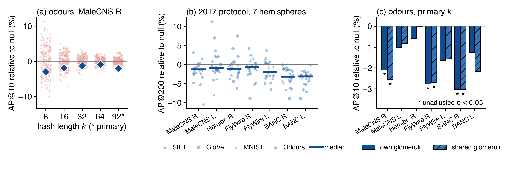

# FlyHash-Connectome

The fly hashing algorithm of Dasgupta, Stevens and Navlakha (*Science*, 2017)
models the fly olfactory circuit as a locality-sensitive hash: glomerular
input is expanded through a sparse binary projection onto Kenyon cells and
sparsified by winner-take-all. They drew that projection at random because the
wiring was unknown. This repository replaces it with the glomerulus-to-Kenyon-
cell connectivity of four connectomes (MaleCNS, hemibrain, FlyWire, BANC: four
animals, seven hemispheres) and asks whether retrieval changes.

In short:

- **The 2017 pattern holds in a reimplementation.** On SIFT, GloVe and MNIST
  (and odour mixtures), the fly hash beats k Gaussian projections at short hash
  lengths (3.1x in AP@200 on MNIST at k = 4), and the lead shrinks with k.
  The published absolute values are not reproduced: the paper's score is
  undefined, and two protocol details come from later code.
- **The measured pairing gives no consistent advantage.** Across four
  connectomes the fly hash keeps its advantage over LSH, and retrieval is
  slightly lower than with degree-preserving rewiring (median -1.6%). The
  pairing departs from random in most reconstructions, but that did not
  coincide with better retrieval under these protocols.
- **Separately, even fan-out helps in the model.** At equal connection count,
  giving every glomerulus the same number of Kenyon cells improves retrieval
  in all seven hemispheres (+3.9% to +6.4% on average, 95% intervals above
  zero); equalising inputs per cell lowers it on average.
- **Against real-valued LSH, the advantage is per active cell, not per
  operation.** Gaussian projections given the same projection arithmetic as
  the fly network retrieve better on every dataset and input dimension tested;
  against one-bit codes the comparison is closer.
- **On odours** (DoOR mixtures) the MaleCNS connectome scores about 2% below
  its rewirings; the deficit disappears when unmeasured responses are imputed.

These are statements about a binary rate-free model and one task family. They
do not establish what the measured structure is for.



## Results

<!-- results:start (generated by `python -m flypath report`; do not edit) -->

Primary hash size k = 92 (5% of 1838 Kenyon cells), 4000 synthetic mixtures, 200 curveball nulls:

| k | measured | null mean +/- SD | rel. diff. | p (two-sided) | p (Holm) |
|---|---|---|---|---|---|
| 8 | 0.1973 | 0.2034 +/- 0.0085 | -2.97% | 0.468 | 1.000 |
| 16 | 0.2879 | 0.2933 +/- 0.0062 | -1.84% | 0.438 | 1.000 |
| 32 | 0.3531 | 0.3575 +/- 0.0045 | -1.24% | 0.338 | 1.000 |
| 64 | 0.3963 | 0.4001 +/- 0.0039 | -0.94% | 0.348 | 1.000 |
| 92 (primary) | 0.4063 | 0.4148 +/- 0.0035 | -2.06% | 0.020 | (primary, not adjusted) |

Two-stage bootstrap 90% interval for the relative difference at the primary size: [-3.1%, -0.8%]; interval within the chosen +/-5% margin: yes.

Fly hash / Gaussian sign code at k = 92: 1.37x at k bits, 0.90x at matched storage (523 bits), 1.33x at matched operations (102 bits).

2017 protocol with random matrices, MNIST, k = 4: LSH 0.031 (reported 0.160), fly hash 0.094 (reported 0.448).

Connectome under the 2017 protocol (SIFT, GloVe, MNIST via PCA; odours): -10.2% to +1.8% relative to 50 curveball nulls across 24 dataset-size combinations.

Coverage of the 90% interval in simulation: 100% (previous procedure: 87%).

Robustness: 26 one-factor variations, see [results/SUPPLEMENT.md](results/SUPPLEMENT.md).

<!-- results:end -->

Every number above, in the figure and in the paper is regenerated from
`results/*.json` by `python -m flypath report`. The full robustness grid,
power table, coverage study and curveball mixing diagnostics are in
[results/SUPPLEMENT.md](results/SUPPLEMENT.md).

## Try it

**[Interactive demo](https://ssenge.github.io/FlyHash-Connectome/web/mushroom-body-hash.html)**
runs the hash in the browser on the MaleCNS connectome. Switching from **Real fly**
to **Scrambled** (a degree-preserving rewiring) replaces most cells in each tag
while the retrieved odours change comparatively little. It illustrates the
comparison; it is not the analysis.

## Reproduce

```bash
conda env create -f environment.yml && conda activate flybrain   # exact versions
python -m flypath build            # downloads MaleCNS v1.0 (~1.1 GB), builds the graph
python -m flypath checksums        # verifies every input against DATA_CHECKSUMS.txt
python -m flypath analyse          # primary analysis, architecture, mixing (~45-60 min)
python -m flypath robustness       # 25 one-factor variations (~45 min)
python -m flypath coverage         # coverage of the bootstrap interval (~60-90 min)
python -m flypath replicate        # 2017 protocol: random matrices, dimension sweep, MaleCNS (~4 h)
python -m flypath connectomes      # all four connectomes, seven hemispheres (~6 h)
python -m flypath report           # figure, paper/generated.tex, supplement, README block
pytest                             # tests; the data-marked ones need the build
cd paper && pdflatex flyhash.tex && pdflatex flyhash.tex
```

`environment.lock.yml` records the full resolved environment. DoOR is fetched
from a pinned commit; MaleCNS files are versioned upstream and checksummed here.
The robustness check at a 5-synapse threshold needs a second graph:
`data/graph_w5`, built by `flypath build` with `build.min_weight: 5` and
`data.graph_dir: data/graph_w5` in a `config.yaml`.

## Method in brief

- **Projection.** Every reconstructed connection, the same rule for all four
  connectomes; the primary one is the MaleCNS right hemisphere: 51
  glomeruli, 1,886 Kenyon cells. Projection neurons are aggregated by
  glomerulus, so column sums are *distinct glomerular inputs*, not anatomical
  claw counts. The odour analysis uses the 35 glomeruli DoOR measures for at
  least 51 odorants (the next best have at most 24; five have none); all 46
  with any data is a sensitivity analysis.
- **Null.** Uniform over binary matrices with the same row and column sums,
  sampled by curveball trades (uniformity: Carstens 2015). Only the pairing
  varies.
- **Hash.** Unit-mean normalisation, expansion, exactly *k* winners with a
  stated tie rule. Primary *k* is 5% of Kenyon cells, fixed in advance.
- **Benchmark.** Synthetic linear mixtures of DoOR profiles; 28.7% of source
  entries are unmeasured and set to zero in the baseline (imputations are
  sensitivity analyses). Ground truth: raw Euclidean *k*-NN; normalised and
  angular distances are sensitivity analyses.
- **Inference.** Approximate Monte Carlo randomization test against 200
  curveball nulls, Holm across secondary sizes (primary size and families
  fixed after first results, not preregistered); a two-stage bootstrap
  (resampling source odorants, regenerating the benchmark, drawing 20 nulls per
  replicate from the same pool of 200) whose coverage was checked for one
  fitted generator; a ±5% equivalence margin; two-sided power under a
  shift model.
- **2017 protocol (reimplemented).** 10,000 vectors each of SIFT, GloVe,
  MNIST; 1,000 queries; top 2% neighbours; AP@200 and recall@200 over 50
  trials; fly with m = 20k or 10d Kenyon cells, each sampling 10% of inputs.
  For the connectomes, image and word data are reduced by PCA to one component
  per glomerulus. The provenance of every protocol detail is in the paper.
- **Controls.** Matrices with the connectome's number of connections and
  either inputs per cell, fan-out per glomerulus, or both made even.
- **Baselines.** LSH with *k* projections (as in 2017); on odours, Gaussian sign
  codes at *k* bits, at matched storage (⌈log₂ C(m,k)⌉ bits) and at matched
  operations (nnz(M)/2d bits, the 2017 operation count).

## Layout

```
flypath/flyhash.py      wiring, nulls, hash, retrieval, odour data, budgets
flypath/stats.py        randomization test, Holm, bootstrap, power, equivalence
flypath/experiments.py  odour experiments; writes results/*.json
flypath/replication.py  the 2017 protocol, random matrices and connectomes
flypath/connectomes.py  loaders for MaleCNS, hemibrain, FlyWire, BANC; the comparison
flypath/report.py       figure, LaTeX numbers, supplement, README block
paper/flyhash.tex       the paper; numbers come from paper/generated.tex
results/                JSON results, figure, SUPPLEMENT.md
tests/                  unit and artifact tests
web/                    the interactive demo
```

## Data and citation

- Connectome: S. Berg *et al.*, "Sexual dimorphism in the complete *Drosophila*
  male central nervous system connectome", *Cell* (2026),
  doi:10.1016/j.cell.2026.08.015. Data: MaleCNS v1.0, CC-BY,
  <https://male-cns.janelia.org/>.
- Odours: D. Münch and C. G. Galizia, DoOR 2.0, *Scientific Reports* 6:21841
  (2016), data at commit `db323a4` of ropensci/DoOR.data.
- Further connectomes: hemibrain v1.2 (Scheffer et al., *eLife* 2020), FlyWire
  v783 (Dorkenwald et al., *Nature* 2024; annotations Schlegel et al., *Nature*
  2024), BANC v888 (Bates et al., *Nature* 2026).
- Benchmarks: MNIST (LeCun et al.), SIFT-small (INRIA TEXMEX), GloVe 6B
  (Stanford NLP), downloaded on first use and checksummed.
- The model tested: S. Dasgupta, C. F. Stevens and S. Navlakha, *Science*
  358:793–796 (2017).

Code is MIT; the datasets carry their own licences and are downloaded rather
than redistributed.
