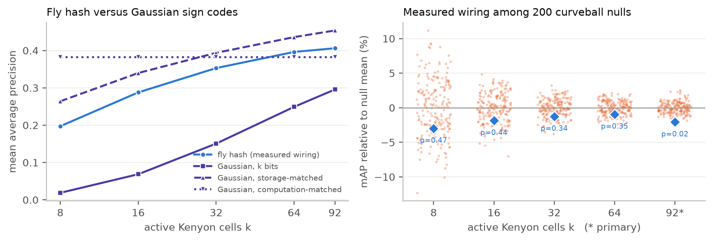

# FlyHash-Connectome

The fly hashing algorithm of Dasgupta, Stevens and Navlakha (*Science*, 2017)
models the fly olfactory circuit as a locality-sensitive hash: glomerular
input is expanded through a sparse binary projection onto Kenyon cells and
sparsified by winner-take-all. They drew that projection at random because the
wiring was unknown. This repository replaces it with the measured
glomerulus-to-Kenyon-cell connectivity of the MaleCNS connectome (2026) and
asks whether retrieval quality changes.

In short, on this model and benchmark:

- the measured pairing of glomeruli with Kenyon cells is **structured**: its
  glomerulus co-occurrence exceeds that of every uniform degree-preserving
  rewiring we drew;
- its retrieval score is **not distinguishable** from those rewirings, with
  point estimates slightly below their mean;
- the fly hash beats a Gaussian sign code only when both are compared at
  *k* bits; at **matched storage** it trails, and at **matched computation** it
  trails for small *k* and is near parity for large *k*.

These are statements about a binary rate-free model evaluated on synthetic
mixtures of partially observed DoOR odorant profiles. They do not establish
what the measured structure is for.



## Results

<!-- results:start (generated by `python -m flypath report`; do not edit) -->

Primary hash size k = 92 (5% of 1838 Kenyon cells), 4000 synthetic mixtures, 200 curveball nulls:

| k | measured | null mean +/- SD | rel. diff. | p (two-sided) | p (Holm) |
|---|---|---|---|---|---|
| 8 | 0.1973 | 0.2034 +/- 0.0085 | -2.97% | 0.468 | 1.000 |
| 16 | 0.2879 | 0.2933 +/- 0.0062 | -1.84% | 0.438 | 1.000 |
| 32 | 0.3531 | 0.3575 +/- 0.0045 | -1.24% | 0.338 | 1.000 |
| 64 | 0.3963 | 0.4001 +/- 0.0039 | -0.94% | 0.348 | 1.000 |
| 92 (primary) | 0.4063 | 0.4148 +/- 0.0035 | -2.06% | 0.020 | (primary, not adjusted) |

Two-stage bootstrap 90% interval for the relative difference at the primary size: [-3.1%, -0.8%]; equivalence at the pre-specified +/-5% margin: yes.

Fly hash / Gaussian sign code at k = 92: 1.37x at k bits, 0.90x at matched storage (523 bits), 1.06x at matched computation (203 bits).

Coverage of the 90% interval in simulation: 100% (previous procedure: 87%).

Robustness: 25 one-factor variations, see [results/SUPPLEMENT.md](results/SUPPLEMENT.md).

<!-- results:end -->

Every number above, in the figure and in the paper is regenerated from
`results/*.json` by `python -m flypath report`. The full robustness grid,
power table, coverage study and curveball mixing diagnostics are in
[results/SUPPLEMENT.md](results/SUPPLEMENT.md).

## Try it

**[Interactive demo](https://ssenge.github.io/FlyHash-Connectome/web/mushroom-body-hash.html)**
runs the hash in the browser on the measured wiring. Switching from **Real fly**
to **Scrambled** (a degree-preserving rewiring) replaces most cells in each tag
while the retrieved odours change comparatively little. It illustrates the
comparison; it is not the analysis.

## Reproduce

```bash
conda env create -f environment.yml && conda activate flybrain   # exact versions
python -m flypath build            # downloads MaleCNS v1.0 (~1.1 GB), builds the graph
python -m flypath checksums        # verifies every input against DATA_CHECKSUMS.txt
python -m flypath analyse          # primary analysis, architecture, mixing (~45-60 min)
python -m flypath robustness       # 25 one-factor variations (~45 min)
python -m flypath coverage         # coverage of the bootstrap interval (~60-90 min)
python -m flypath report           # figure, paper/generated.tex, supplement, README block
pytest                             # 49 tests; the data-marked ones need the build
cd paper && pdflatex flyhash.tex && pdflatex flyhash.tex
```

`environment.lock.yml` records the full resolved environment. DoOR is fetched
from a pinned commit; MaleCNS files are versioned upstream and checksummed here.
The robustness check at a 5-synapse threshold needs a second graph:
`data/graph_w5`, built by `flypath build` with `build.min_weight: 5` and
`data.graph_dir: data/graph_w5` in a `config.yaml`.

## Method in brief

- **Projection.** Right hemisphere, every reconstructed connection. Projection
  neurons are aggregated by glomerulus, so column sums are *distinct
  glomerular inputs*, not anatomical claw counts.
- **Null.** Uniform over binary matrices with the same row and column sums,
  sampled by curveball trades (uniformity: Carstens 2015). Only the pairing
  varies.
- **Hash.** Unit-mean normalisation, expansion, exactly *k* winners with a
  stated tie rule. Primary *k* is 5% of Kenyon cells, fixed in advance.
- **Benchmark.** Synthetic linear mixtures of DoOR profiles; 28.7% of source
  entries are unmeasured and set to zero in the baseline (imputations are
  sensitivity analyses). Ground truth: raw Euclidean *k*-NN; normalised and
  angular distances are sensitivity analyses.
- **Inference.** Exact randomization test against 200 nulls, Holm across
  secondary sizes; a two-stage bootstrap (resampling source odorants,
  regenerating the benchmark, re-drawing null matrices) whose coverage is
  checked by simulation; a pre-specified ±5% equivalence margin; power under a
  shift model.
- **Baselines.** Gaussian sign codes at *k* bits, at matched storage
  (⌈log₂ C(m,k)⌉ bits) and at matched computation (nnz(M)/d bits).

## Layout

```
flypath/flyhash.py      wiring, nulls, hash, retrieval, odour data, budgets
flypath/stats.py        randomization test, Holm, bootstrap, power, equivalence
flypath/experiments.py  every experiment; writes results/*.json
flypath/report.py       figure, LaTeX numbers, supplement, README block
paper/flyhash.tex       the paper; numbers come from paper/generated.tex
results/                JSON results, figure, SUPPLEMENT.md
tests/                  49 tests
web/                    the interactive demo
```

## Data and citation

- Connectome: S. Berg *et al.*, "Sexual dimorphism in the complete *Drosophila*
  male central nervous system connectome", *Cell* (2026),
  doi:10.1016/j.cell.2026.08.015. Data: MaleCNS v1.0, CC-BY,
  <https://male-cns.janelia.org/>.
- Odours: D. Münch and C. G. Galizia, DoOR 2.0, *Scientific Reports* 6:21841
  (2016), data at commit `db323a4` of ropensci/DoOR.data.
- The model tested: S. Dasgupta, C. F. Stevens and S. Navlakha, *Science*
  358:793–796 (2017).

Code is MIT; the datasets carry their own licences and are downloaded rather
than redistributed.
